# 基于springboot海滨体育馆管理系统

---
### 👉作者QQ ：1556708905 微信：zheng0123Long (支持定制修改、部署调试、定制毕设)

### 👉接网站建设、小程序、H5、APP、各种系统等

---

#### 介绍

基于Springboot的海滨体育馆管理系统是一款专为高校体育馆设计的高效管理平台，旨在提升体育馆的管理效率和学生的使用体验。系统分为管理员角色和学生角色，每个角色都有相应的功能模块，以满足不同用户的需求和职责。

#### 技术栈

后端技术栈：Springboot+Mysql+Maven

前端技术栈：Vue+Html+Css+Javascript+ElementUI

开发工具：Idea+Vscode+Navicate

#### 系统功能介绍

管理员角色功能模块

个人中心：查看和编辑个人信息，包括修改密码和更新联系方式。

学生管理：管理学生信息，包括新增、修改和删除学生信息，确保学生数据的准确性。

器材管理：管理体育器材的信息，包括新增、修改和删除器材。

器材借出管理：记录和管理器材的借出信息，确保器材的合理使用和流通。

器材归还管理：管理器材的归还信息，确保器材的及时归还和状态更新。

器材分类管理：分类管理体育器材，便于器材的查找和管理。

校队管理：管理校队的信息，包括校队成员和活动记录。

进入登记管理：记录学生进入体育馆的信息，确保场馆使用的安全和有序。

离开登记管理：记录学生离开体育馆的信息，确保场馆使用的安全和有序。

活动预约管理：管理和审批体育馆活动的预约信息，确保场馆资源的合理使用。

灯光管理：管理体育馆内灯光的使用和维护，确保场馆照明的正常运作。

体育论坛：管理体育论坛，发布和审核帖子，促进师生之间的交流与互动。

学生角色功能模块

器材：查看和借用体育器材，了解器材的使用信息。

体育论坛：参与体育论坛的讨论，发布和回复帖子，交流体育心得和信息。

体育资讯：查看最新的体育资讯和活动通知，获取相关信息。

个人中心：查看和编辑个人信息，包括修改密码和更新联系方式。

后台管理：

器材管理：查看个人借用的器材信息，管理器材的借出和归还。

器材借出管理：申请借用体育器材，查看借出记录。

器材归还管理：归还借用的体育器材，查看归还记录。

校队管理：查看校队信息，参与校队活动。

进入登记管理：登记进入体育馆的信息，确保场馆使用的安全和有序。

离开登记管理：登记离开体育馆的信息，确保场馆使用的安全和有序。

活动预约管理：预约体育馆活动，查看和管理个人预约信息。

#### 系统作用

对管理员的作用

高效管理：系统提供全面的管理工具，帮助管理员高效管理学生、器材和场馆活动，确保管理工作的有序进行。

信息传达：通过体育论坛和体育资讯模块，管理员可以及时发布重要信息和通知，确保信息传递的及时性。

资源优化：通过活动预约和器材管理，管理员可以优化场馆资源的使用，确保资源的合理分配。

对学生的作用

便捷使用：学生可以通过系统方便地借用和归还体育器材，预约场馆活动，提高使用效率。

信息获取：通过体育资讯模块，学生可以及时获取最新的体育活动和通知，确保信息的透明和及时。

交流互动：通过体育论坛，学生可以参与讨论和交流，分享体育心得和信息，增强互动性。

#### 系统功能截图

代码结构

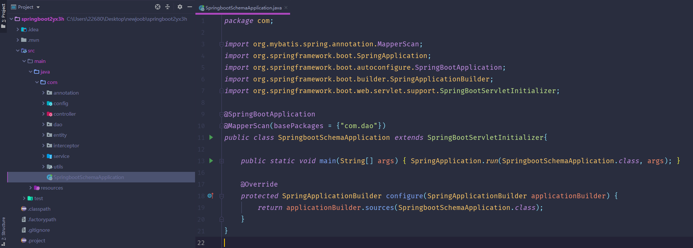

数据库表

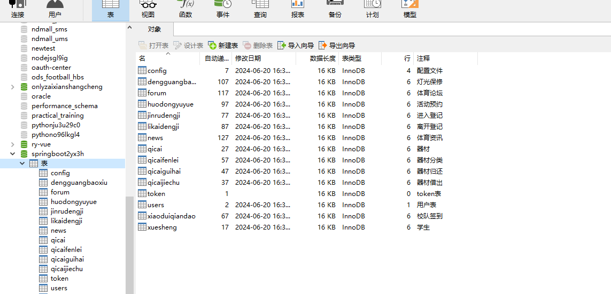

登录

首页

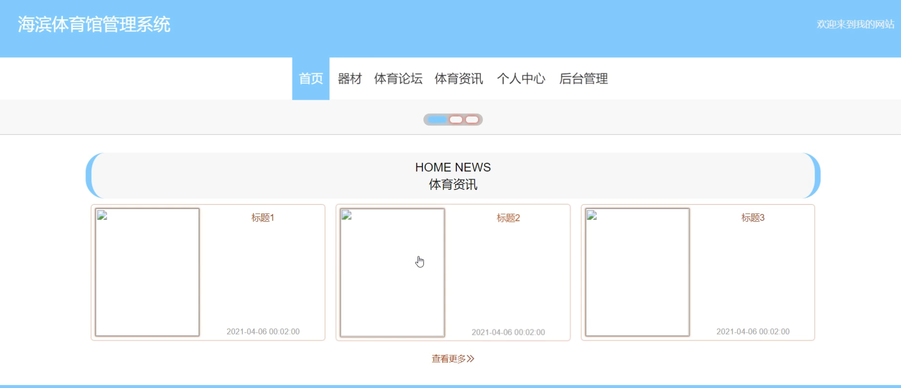

器材

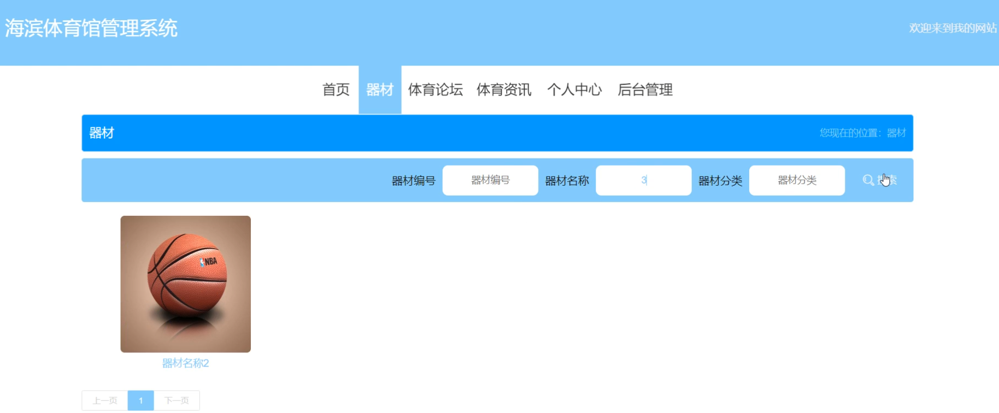

体育论坛

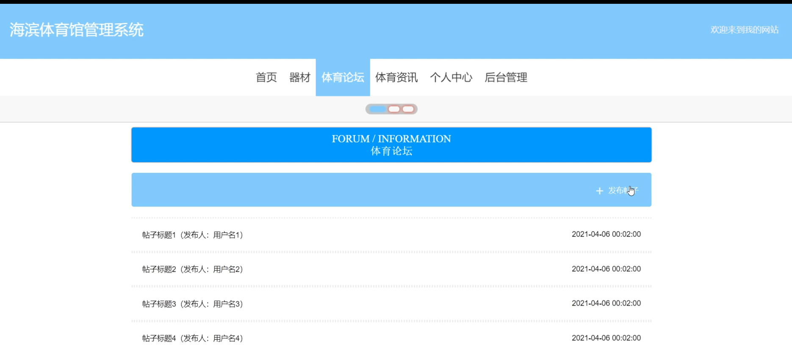

个人中心

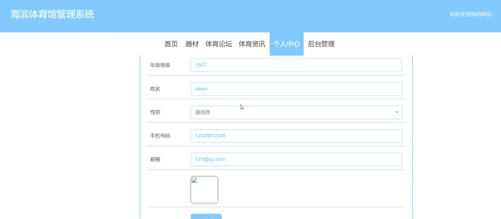

后台管理

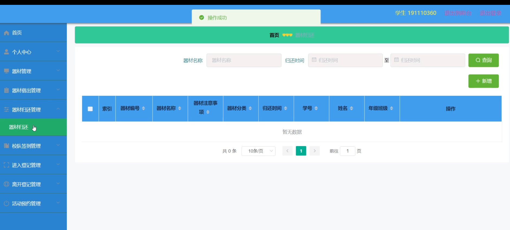

校队签到管理

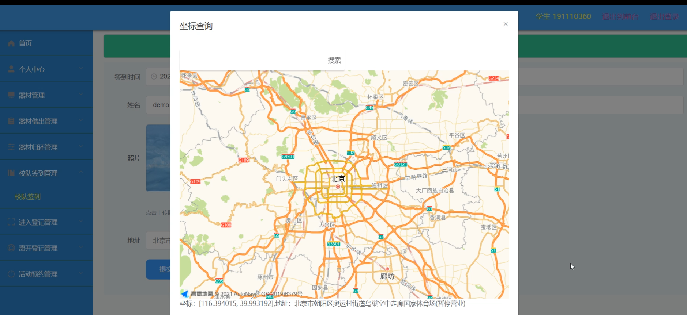

进入登记管理

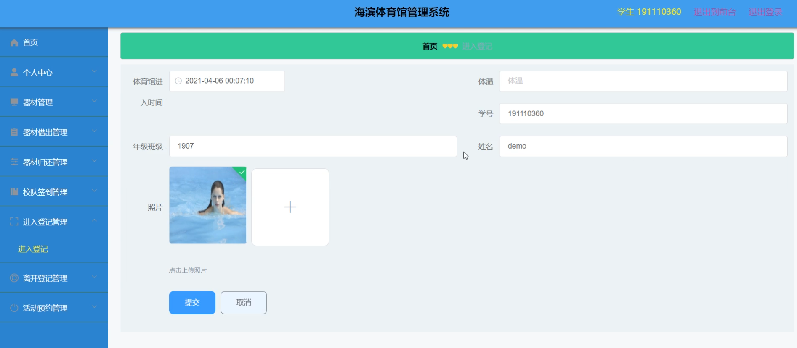

管理端学生管理

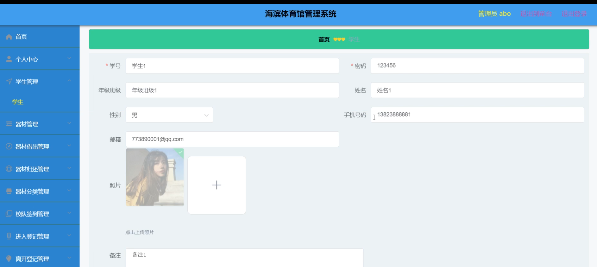

活动预约

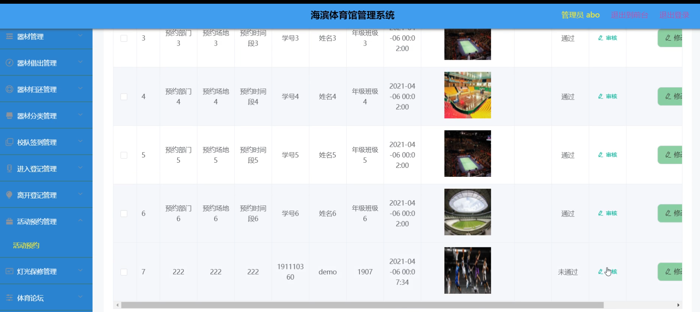

灯光保修管理

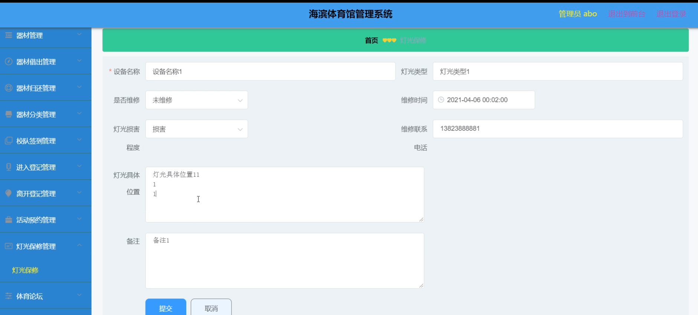

#### 总结

基于Springboot的海滨体育馆管理系统通过角色分工和功能模块的设计，实现了体育馆管理的高效化和便捷化。管理员可以通过系统高效管理学生、器材和场馆活动，确保资源的合理分配和使用；学生则可以方便地借用器材、预约活动，并参与体育论坛的交流。该系统不仅提升了体育馆的管理效率，也为学生提供了便捷的使用体验和丰富的互动平台。

#### 使用说明

创建数据库，执行数据库脚本 修改jdbc数据库连接参数 下载安装maven依赖jar 启动idea中的springboot项目

后台地址：http://localhost:8080/springboot2yx3h/admin/dist/index.html

管理员  abo 密码 abo

前台地址：http://localhost:8080/springboot2yx3h/front/index.html

